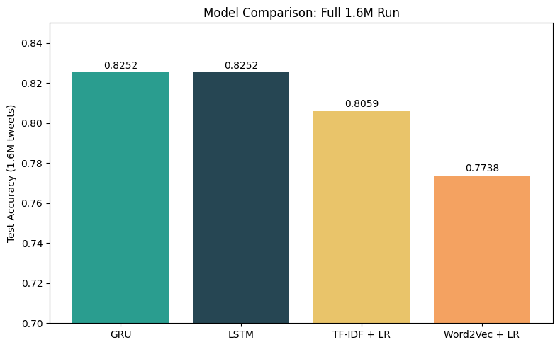

# Twitter Sentiment Analysis: Four Models, One Controlled Comparison

Binary sentiment classification on the Sentiment140 dataset (1.6 million tweets, positive vs negative). This project compares four models on identical data, an identical cleaning step, and an identical train/test split, so the accuracy differences reflect the models themselves and not differences in preprocessing.

The four models began as separate coursework notebooks that each used different data paths, different preprocessing, and different splits. This repository consolidates them into one apples to apples experiment.

## Results

Full 1.6M run. After the shared clean, 3,657 empty rows were dropped, leaving 1,596,343 tweets (1,277,074 train / 319,269 test, roughly balanced).

| Model | Test Accuracy (1.6M) | Test Accuracy (160k subset) |
|---|---|---|
| GRU | 0.8252 | 0.7875 |
| LSTM | 0.8252 | 0.7873 |
| TF-IDF + Logistic Regression | 0.8059 | 0.7916 |
| Word2Vec + Logistic Regression | 0.7738 | 0.7567 |

## The headline: the ranking flipped with scale

On a 160,000 tweet subset, the classical TF-IDF baseline won (0.7916) and the two recurrent networks were data starved (0.7875 and 0.7873). On the full 1.6 million tweets, both RNNs jumped about 3.8 points to 0.8252 while TF-IDF gained only about 1.5 points to 0.8059.

The lesson is a clean one: deep models need data to earn their complexity, and below a certain data threshold a simple classical baseline is the better choice. Reporting both data points tells that story better than either number alone.

A second result: the GRU and LSTM tied to four decimal places, but the GRU reached that accuracy in 5 epochs against the LSTM's 6, with fewer parameters. The GRU matched the LSTM at lower cost, so it is the model behind the live demo.

## Live demo

Try it here: [Hugging Face Space](https://huggingface.co/spaces/SamOryeJack/Twitter-Sentiment-RNN). Type a tweet and the GRU returns a positive or negative label with a confidence score.

## Methodology

The point is the controlled comparison, so every model sees the same data:

- One shared cleaning step for all four models: strip @mentions and URLs, keep letters and spaces only, lowercase. No heavy lemmatization.
- Empty rows (tweets that clean to nothing) are dropped before the split, so all four models train and test on the identical set of rows.
- One stratified 80/20 split (random_state=42).
- Every vectorizer and tokenizer is fit on the training set only, so the test set stays unseen until final evaluation.

Model details:

- TF-IDF + LR: TfidfVectorizer (10,000 features, unigrams and bigrams) into LogisticRegression (C=1, L2).
- Word2Vec + LR: 200 dimensional vectors trained on the training tokens, mean pooled per tweet, into LogisticRegression.
- GRU: Embedding with masking into a 128 unit GRU, dropout 0.3, sigmoid output, EarlyStopping on validation loss.
- LSTM: the same architecture with a 128 unit LSTM.

## How to run

Open the notebook in Colab with the badge above, or run it locally:
